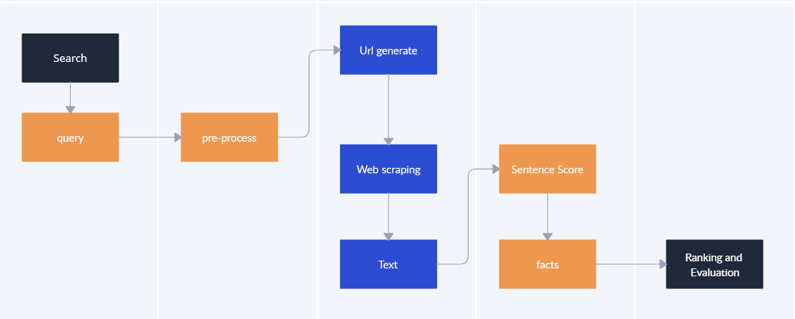
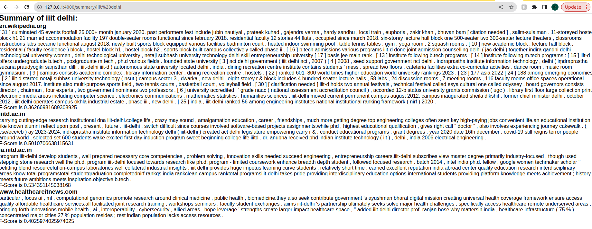

<h1 align="left">
  IR_PROJECT
</h1>
Information retrievel Course Project

<h1 align="left">
  Intelligent Search Engine
</h1>

FRONT PAGE OF OUR PROJECT


<h1 align="left">
  Synopsis
</h1>

“ Fact extraction from a given Query with ranking as relevancy ” - The problem statement is to develop a system that can extract relevant facts or information from a given website link when a query is entered. The system will utilize a mixture of several techniques and advance algorithms. The main goal is to provide users with accurate and useful information from the website link that is most relevant to their query by ranking them.

<h1 align="left">
  Motivation
</h1>

The amount of digital data is growing at an unprecedented rate, and extracting relevant information from this data has become increasingly challenging. Automated fact extraction systems have the potential to address this issue by quickly and accurately extracting relevant information from a large amount of unstructured data. Information retrieval is an important research area that focuses on developing algorithms and systems to retrieve relevant information from a large corpus of data.

In recent years, there has been significant research interest in developing automated systems that can extract facts or information from websites when a user enters a query. Such systems have numerous applications, including providing users with quick and accurate answers to their queries, facilitating knowledge discovery, and supporting decision-making processes.

However, despite the advancements in the field of information retrieval, the development of an effective fact extraction system remains a challenging task. In particular, there are several issues that need to be addressed, such as identifying the most relevant information from websites, dealing with noisy and incomplete data, and evaluating the effectiveness of the fact extraction system.

We aim to propose a novel approach for extracting relevant facts or information from web pages using a combination of web scraping, extraction based on weighting, fact extraction, and BM25 for ranking. The proposed approach will be evaluated using real-world data, and we’ll get the desired output.


<h1 align="left">
  Work Flow
</h1>

Work flow of our project



<h1 align="left">
  Development setup
</h1>

1.Front end

```bash
HTMTL,CSS
FLASK,
```
2.Back end

```bash
Python
bm25(Rank retrievel),web scraping,F1 Score.
```
3.Required Python libraries

```bash
pip3 install flask
pip3 install transformers
pip3 install pandas
pip3 install nltk
pip3 install pytorch torchvision -c pytorch
pip3 install rank_bm25
pip3 install bs4
pip3 install gensim
```
4.Activate virtual Environment in Windows using VScode

```bash
$ pip install virtualenv
$ virtualenv env
$ source ./env/Scripts/activate
$ ./app.py
```

5.Localhost

```bash
Open localhost:4000 on browser
```
6.Run Code

```bash
1. We go to app.py directory
2. Run python3 app.py
3. Open the local host link http://127.0.0.1:4000/
4. Enter query and summary is generated.
```
<h1 align="left">
  User Interface
</h1>

Home page


Retrievel page




<h1 align="left">
  Contributors
</h1>

- [Kamta Prasad Shukla](https://github.com/kpshukla123)
- [Naveesh Rana](https://github.com/Naveeshrana22043)
- [Nandini Soni](https://github.com/soninandini)
- [Divy Thakkar](https://github.com/divythakkar111)
- [Swaib ilias Mazumder](https://github.com/swaib22078)
